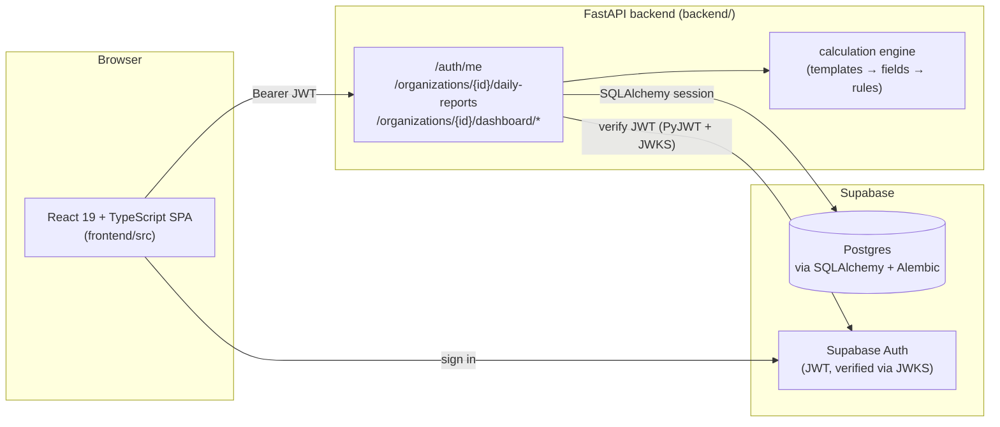
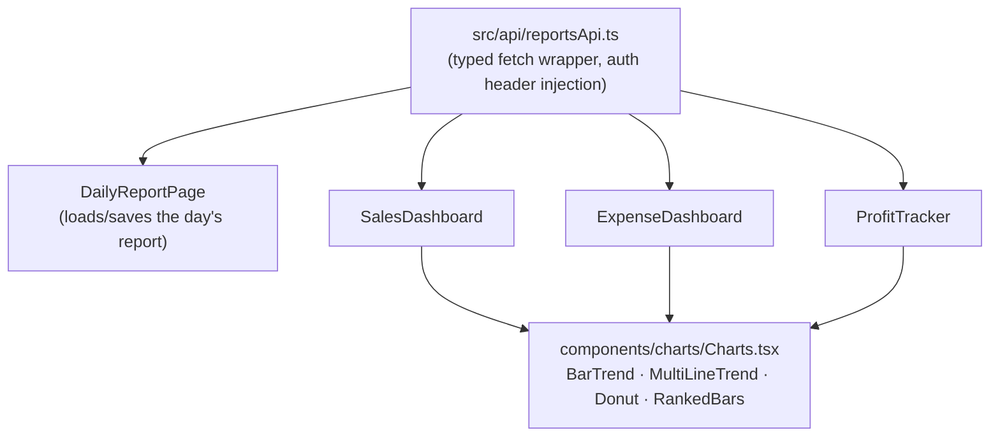

# MAARA AI — Business Manager

A daily sales & expense ledger for small food businesses, with Sales, Expense and
Profit dashboards built on top of it. Built for **Dosa n Chutney** as the pilot
tenant.

This README is written for anyone joining the project cold — it explains what
exists today and how the pieces fit together, so you don't have to
reverse-engineer it from the code.

## Status at a glance

| Layer | State |
|---|---|
| Frontend UI (entry form + 3 dashboards) | ✅ Built, fully interactive |
| Frontend data | ✅ Real — reads/writes through the backend API, no mock data |
| Backend API | ✅ FastAPI, tenant-scoped, JWT-verified |
| Database models & migrations | ✅ Multi-tenant schema, versioned via Alembic |
| Auth | ✅ Supabase Auth (email/password), JWT verified server-side via JWKS |
| Calculation engine | ✅ Config-driven (templates/fields/rules), no hardcoded formulas |
| Deployment | ✅ Frontend on Vercel, backend on Render |

**The most important thing to know:** the Daily Sales Report form persists to
Postgres (via Supabase) and runs through a generic calculation engine — nothing
in the reporting logic is restaurant-specific or hardcoded. The three
dashboards (Sales, Expenses, Profit) are computed on read from that same saved
data. See [Architecture](#architecture) for how the pieces connect.

## Architecture



Sign-in goes straight from the browser to Supabase Auth (`supabase-js`); the
resulting JWT is attached to every backend request and verified server-side
against Supabase's JWKS. All reporting data — daily report values, expenses,
dashboard aggregates — is read from and written to Postgres through the
backend, scoped to the caller's organization membership.

## Frontend data flow



Each page fetches its own data independently from the backend — there's no
shared mock dataset anymore. `src/data/reportData.ts` now only holds pure
formatting/derivation helpers (currency formatting, % change, date labels)
shared across the dashboards.

## Repo layout

```
MAARA-AI-Business-Manager/
├── frontend/                      React 19 + TypeScript + Vite SPA
│   ├── public/                    Logo, favicon
│   └── src/
│       ├── api/                       client.ts, reportsApi.ts, types.ts — typed backend API layer
│       ├── lib/supabaseClient.ts      Supabase JS client (auth)
│       ├── pages/
│       │   ├── LoginPage.tsx          Sign-in/sign-up via Supabase Auth
│       │   ├── DailyReportPage.tsx    Shell: sidebar nav + daily report load/save
│       │   ├── SalesDashboard.tsx     Revenue by channel, trend, comparisons
│       │   ├── ExpenseDashboard.tsx   Spend by category, trend, recent expenses
│       │   └── ProfitTracker.tsx      Revenue vs expenses vs profit, daily P/L, cash reconciliation
│       ├── components/charts/
│       │   └── Charts.tsx             Small dependency-free SVG chart primitives
│       ├── data/reportData.ts         Shared formatting/derivation helpers (no data)
│       └── App.tsx / App.css          Session state, routing between pages, all styling
│
├── backend/                       FastAPI service
│   ├── main.py                    App entrypoint, router registration, CORS
│   ├── api/v1/                    auth, report_templates, daily_reports, dashboards routers
│   ├── auth/                      JWT verification (JWKS), org-role permission checks
│   ├── calculations/              registry, dependency graph, evaluator — the calc engine
│   ├── services/                  report_service, dashboard_service, template_service
│   ├── repositories/              DB access for daily reports/templates
│   ├── schemas/                   Pydantic request/response models
│   ├── database/
│   │   ├── connection.py          SQLAlchemy engine/session, reads DATABASE_URL
│   │   ├── base.py                Declarative Base
│   │   └── models/                organization, membership, profile, template, daily_report, expense_category, audit
│   ├── alembic/                   Migrations (schema, seed data, FK fixes)
│   ├── scripts/                   One-off admin scripts (e.g. grant_org_owner.py)
│   ├── tests/                     pytest — calculation engine unit tests
│   ├── requirement.txt            Python dependencies
│   ├── runtime.txt                Pinned Python version (Render)
│   └── .env.example               Template for required environment variables
│
├── render.yaml                    Render Blueprint for the backend service
├── .gitignore
└── README.md
```

## Tech stack

| Area | Choice |
|---|---|
| Frontend | React 19, TypeScript, Vite 8 |
| Styling | Plain CSS (`App.css`) — no framework; one design system via CSS custom properties |
| Charts | Hand-built inline SVG components, no charting library |
| Backend | FastAPI, Uvicorn |
| ORM / DB driver | SQLAlchemy 2, `psycopg[binary]` (psycopg3) |
| Migrations | Alembic |
| Database | Postgres, hosted on Supabase |
| Auth | Supabase Auth (JWT, verified server-side via JWKS) |
| Frontend hosting | Vercel (root directory `frontend`) |
| Backend hosting | Render (see `render.yaml`, root directory `backend`) |

## Getting started

### Frontend

```bash
cd frontend
npm install
npm run dev        # http://localhost:5173
```

### Backend

```bash
cd backend
python -m venv .venv
.venv\Scripts\activate      # or `source .venv/bin/activate` on macOS/Linux
pip install -r requirement.txt

copy .env.example .env      # or `cp` on macOS/Linux — then fill in real values
alembic upgrade head
uvicorn main:app --reload --port 8000
```

### Environment variables

**`backend/.env`**

| Variable | Purpose |
|---|---|
| `DATABASE_URL` | Postgres connection string (Supabase session pooler recommended) |
| `SUPABASE_URL` | Your Supabase project URL |
| `SUPABASE_ANON_KEY` | Public Supabase key, safe for client use |
| `SUPABASE_SERVICE_ROLE_KEY` | **Secret** — full-access key, server-side only, never expose to the frontend |
| `SUPABASE_JWT_AUDIENCE` | Normally `authenticated` |
| `CORS_ALLOW_ORIGINS` | Comma-separated list of allowed frontend origins |

**`frontend/.env`**

| Variable | Purpose |
|---|---|
| `VITE_SUPABASE_URL` | Same Supabase project URL |
| `VITE_SUPABASE_ANON_KEY` | Same public Supabase key |
| `VITE_API_URL` | Backend base URL (`http://localhost:8000` locally, the Render URL in production) |

Both `.env` files are git-ignored. Copy the `.env.example` in each folder and
fill in real values locally; never commit the real files.

## Deployment

- **Frontend (Vercel):** Root Directory = `frontend`, Framework Preset = Vite,
  Build Command = `npm run build`, Output Directory = `dist`. Set the three
  `VITE_*` env vars above in the Vercel dashboard.
- **Backend (Render):** deployed via the `render.yaml` Blueprint at the repo
  root (Root Directory `backend`). Fill in the `sync: false` env vars in the
  Render dashboard on first deploy; `CORS_ALLOW_ORIGINS` should include the
  Vercel production URL.

## Contributing

This project is meant to be worked on by multiple people, so a few ground rules:

- Branch off `main`, open a PR — don't push directly to `main`.
- New calculated fields belong in template/rule config, not hardcoded in a
  service or component — the calculation engine is generic on purpose.
- Never commit `.env` or any real credentials. If you need a new environment
  variable, add a placeholder entry to the relevant `.env.example` too.
