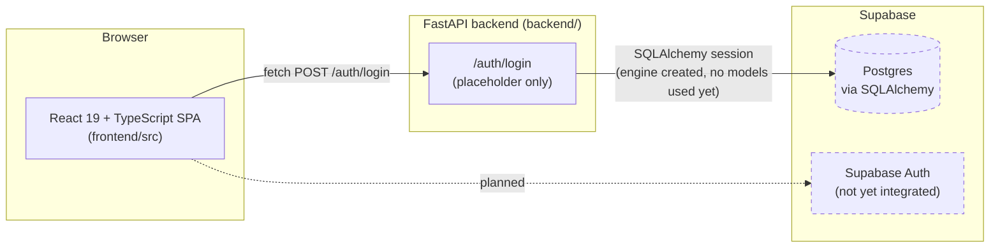
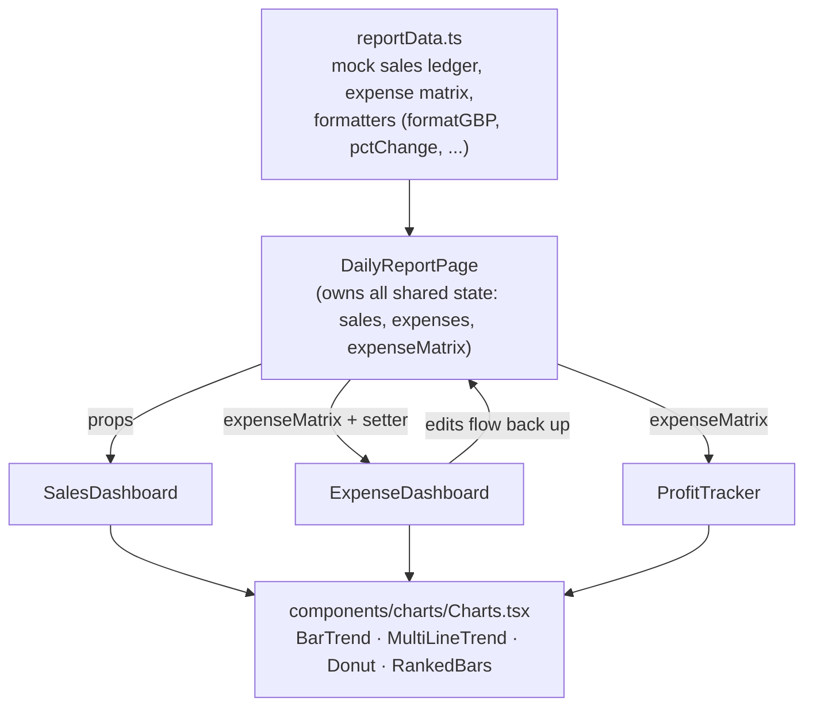

# MAARA AI — Business Manager

A daily sales & expense ledger for small food businesses, with Sales, Expense and
Profit dashboards built on top of it. Built for **Dosa n Chutney** as the pilot
tenant.

This README is written for anyone joining the project cold — it explains what
exists today, what's still a stub, and how the pieces fit together, so you don't
have to reverse-engineer it from the code.

## Status at a glance

| Layer | State |
|---|---|
| Frontend UI (entry form + 3 dashboards) | ✅ Built, fully interactive |
| Frontend data | ⚠️ **Mock data**, not connected to the backend yet |
| Backend API | 🚧 Scaffolded — one placeholder endpoint (`/auth/login`) |
| Database models | 🚧 Empty stubs — no tables defined yet |
| Auth | 🚧 Placeholder — accepts any non-empty email/password |

**The most important thing to know:** the dashboards you see in the app are not
reading from the database. They're computed client-side from a hand-built
dataset in [`frontend/src/data/reportData.ts`](frontend/src/data/reportData.ts)
so the UI has something realistic to render. Wiring the frontend to real
persisted data is the next major piece of work — see [Roadmap](#roadmap).

## Architecture



Today, only the `UI → /auth/login → 200 OK` path is real. Everything inside the
app after login (the ledger, the three dashboards) runs entirely in the browser.

## Frontend data flow



Every KPI, chart and comparison is *computed*, not hardcoded — percentages,
totals and trend lines all derive from the data in `reportData.ts` plus
whatever the user has typed into the expense matrix. That matters for anyone
extending a dashboard: add data to `reportData.ts`, don't hardcode a number in
a component.

## Repo layout

```
MAARA-AI-Business-Manager/
├── frontend/                      React 19 + TypeScript + Vite SPA
│   ├── public/                    Logo, favicon
│   └── src/
│       ├── pages/
│       │   ├── LoginPage.tsx          Sign-in screen (email/password → /auth/login)
│       │   ├── DailyReportPage.tsx    Shell: sidebar nav + top-level state owner
│       │   ├── SalesDashboard.tsx     Revenue by channel, trend, comparisons
│       │   ├── ExpenseDashboard.tsx   Spend by category, fixed vs variable, commissions
│       │   └── ProfitTracker.tsx      Revenue vs expenses vs profit, insights
│       ├── components/charts/
│       │   └── Charts.tsx             Small dependency-free SVG chart primitives
│       ├── data/
│       │   └── reportData.ts          Shared mock dataset + calculation helpers
│       ├── App.tsx / App.css          Session state, routing between pages, all styling
│       └── main.tsx                   Vite entrypoint
│
├── backend/                       FastAPI service (early scaffold)
│   ├── main.py                    App entrypoint + placeholder POST /auth/login
│   ├── auth/                      dependencies.py, permissions.py, schemas.py — empty stubs
│   ├── database/
│   │   ├── connection.py          SQLAlchemy engine/session, reads DATABASE_URL from .env
│   │   ├── base.py                Declarative Base
│   │   └── models/                company.py, project.py, user.py — empty, no tables yet
│   ├── requirement.txt            Python dependencies
│   └── .env.example               Template for the required environment variables
│
├── .gitignore
└── README.md
```

## Tech stack

| Area | Choice |
|---|---|
| Frontend | React 19, TypeScript, Vite 8 |
| Styling | Plain CSS (`App.css`) — no framework; one design system via CSS custom properties |
| Charts | Hand-built inline SVG components, no charting library |
| Backend | FastAPI, Uvicorn |
| ORM / DB driver | SQLAlchemy 2, `psycopg[binary]` (psycopg3) |
| Migrations | Alembic (installed, not yet used — no migrations exist) |
| Database | Postgres, hosted on Supabase |
| Planned auth | Supabase Auth |

## Getting started

### Frontend

```bash
cd frontend
npm install
npm run dev        # http://localhost:5173
```

The frontend calls `VITE_API_URL` (defaults to `http://localhost:8000`) for
login; everything else runs client-side against the mock dataset.

### Backend

```bash
cd backend
python -m venv .venv
.venv\Scripts\activate      # or `source .venv/bin/activate` on macOS/Linux
pip install -r requirement.txt

copy .env.example .env      # or `cp` on macOS/Linux — then fill in real values
uvicorn main:app --reload --port 8000
```

### Environment variables (`backend/.env`)

| Variable | Purpose |
|---|---|
| `DATABASE_URL` | Postgres connection string (Supabase) |
| `SUPABASE_ANON_KEY` | Public Supabase key, safe for client use |
| `SUPABASE_SERVICE_ROLE_KEY` | **Secret** — full-access key, server-side only, never expose to the frontend |

`backend/.env` is git-ignored. Copy `backend/.env.example` and fill in real
values locally; never commit the real file.

## Roadmap

- [ ] Real Supabase Auth wiring (replace the placeholder `/auth/login`)
- [ ] Define the actual database models (`company`, `project`, `user`, and a
      daily-report / expense-entry schema — the current `models/` files are empty)
- [ ] First Alembic migration
- [ ] Persist `DailyReportPage` submissions instead of holding them in local state
- [ ] Replace `reportData.ts`'s mock dataset with real API-backed data once the
      above lands, keeping the same computed-not-hardcoded approach

## Contributing

This project is meant to be worked on by multiple people, so a few ground rules:

- Branch off `main`, open a PR — don't push directly to `main`.
- If you touch `reportData.ts`, prefer adding to the dataset over hardcoding
  numbers in a dashboard component — every dashboard is designed to compute
  from shared data.
- Never commit `.env` or any real credentials. If you need a new environment
  variable, add a placeholder entry to `backend/.env.example` too.
